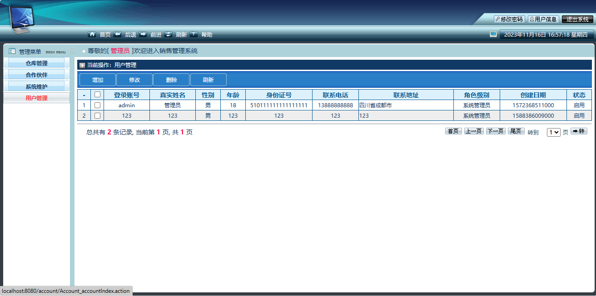

<h1 align="center">基于SSM+Jsp的销售仓库管理系统</h1>

 获取sql文件 QQ: 386869957 QQ群: 377586148 

 [个人站点: 从戎源码网](https://armycodes.com/)

## 简介

> 本代码来源于网络,仅供学习参考使用!
> 
> 提供1.远程部署/2.修改代码/3.设计文档指导/4.框架代码讲解等服务
>
> 访问地址： http://localhost:8080
>
>   用户名： admin  
>   密码： 123456
>

## 项目介绍

基于SSM+Jsp的销售仓库管理系统，前端 `JQuery-ui`，后端 `Spring` `SpringMVC` `MyBatis`，对商品进行进销存管理，使得销售信息数字化，统计信息便于管理员盘点商品出入库和盈亏展示，主要功能如下：

- 基本操作：用户登录、退出
- 商品维护：商品列表、商品增加、商品修改、商品删除；商品是出库和入库的操作对象
- 入库信息：新建入库信息、修改入库信息、删除入库信息；入库需要选择供货商信息
- 出库信息：新建出库信息、修出库信息、删除出库信息；出库需要选择客户信息
- 统计信息：今日盘点、本月盘点、自主盘点；盘点功能主要针对入库和出库信息进行汇总统计，计算出入库次数和收支金额数据，得出盈亏
- 供货商信息：新建供货商信息、修改供货商信息、删除供货商信息
- 客户信息：新建客户信息、修改客户信息、删除客户信息
- 用户管理：新建用户、修改用户、删除用户，用户管理系统角色（系统管理员、仓库管理员、普通管理员），用户状态可以设置为启用、禁用，禁用的用户无法正常登录系统

## 环境

- <b>IntelliJ IDEA 2021.2</b>

- <b>Mysql 5.7.26</b>

- <b>Navicat  11.1.20.0</b>

- <b>Tomcat 7.0.73</b>

- <b>JDK 1.8</b>

## 缩略图

